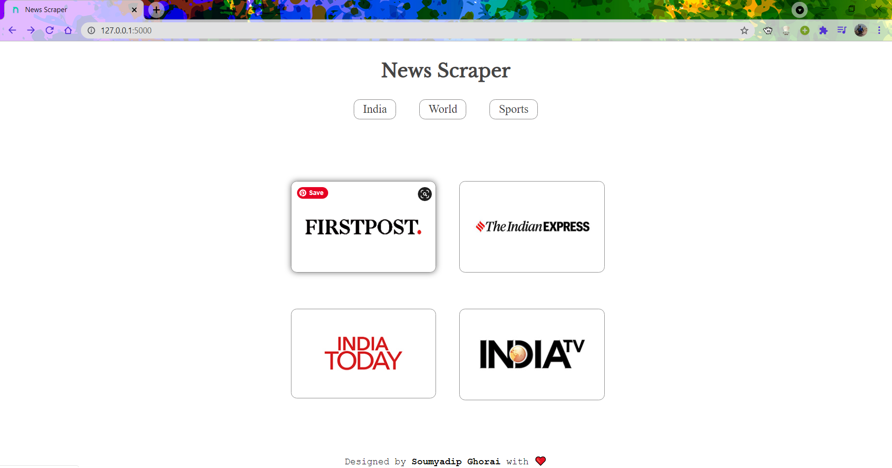
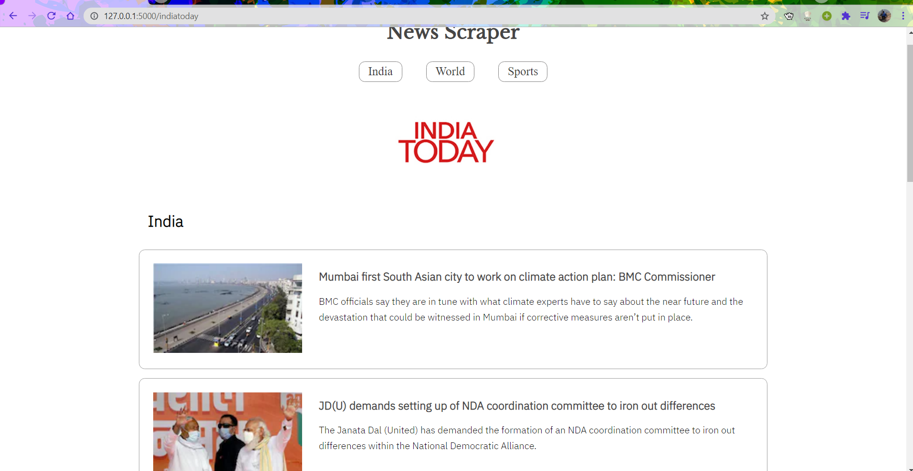
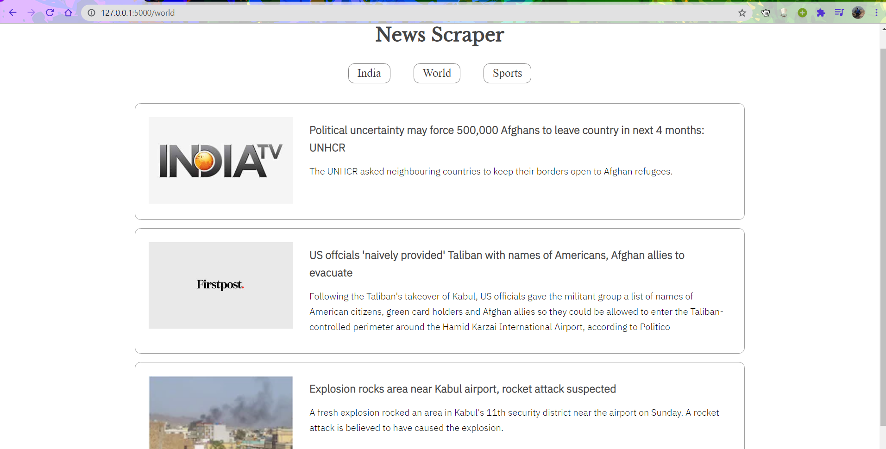

# News-Scrapper

## Hey folks! :wave: 

This is a my first full stack project. :blush: Its a simple news app which gathers news from various sources on real time and show by category along with an image, head line a meta description. 

firstly I have tested various news papers on jupyter notebook and selected the best news papers...

## Language : 

* HTML 
* CSS
* python
<br>

## Features : 
* Responsive 
* Can easily be scalable 
* User can get redirected to the actual article if he wants 
<br>

## Document structure : 

```
|---- result
|   |---- screenshot1.png
|   |---- screenshot2.png
|   |---- screenshot3.png
|
|---- static
|   |---- images 
|   |   |---
|   |   
|   |---- styles
|   |   |--- index.css
|   |   |--- india.css
|   |   |--- indiatoday.css
|   |   |--- layout.css
|
|---- templates
|   |--- index.html
|   |--- india.html
|   |--- indiatoday.html
|   |--- layout.html
|
```

## Demo : 

When you will visit the site you will see this home page.
<br>
<p align = 'center' >
    
</p>
<br>
from this home page you can choose to read a particular paper and find news like this...
<br>
<p align = 'center' >
    
</p>
<br>
or you can directly click on a particular category and can read news on that category across different news papers...
<br>
<p align = 'center' >
    
</p>

<br>
<br>

# If you Liked this project the you can consider connecting with me:
* [LinkedIn](https://www.linkedin.com/in/soumyadip-ghorai/) 

* You can find my other projects and EDAs on [Kaggle](https://www.kaggle.com/soumyadipghorai)
